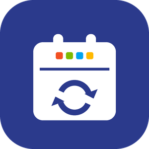
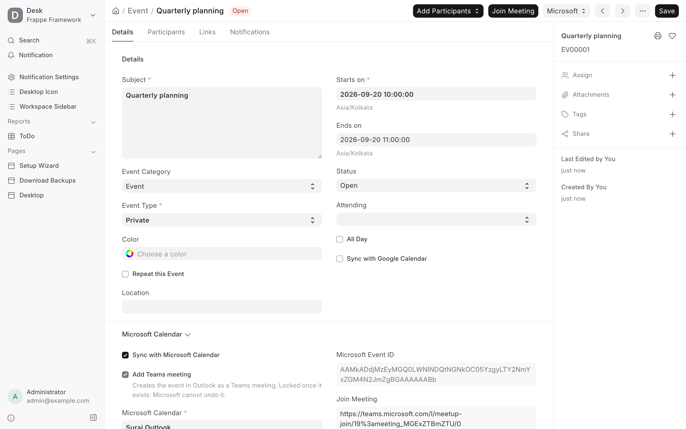
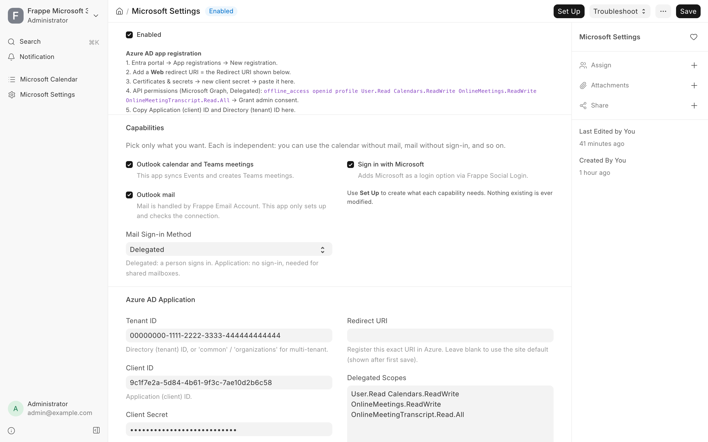
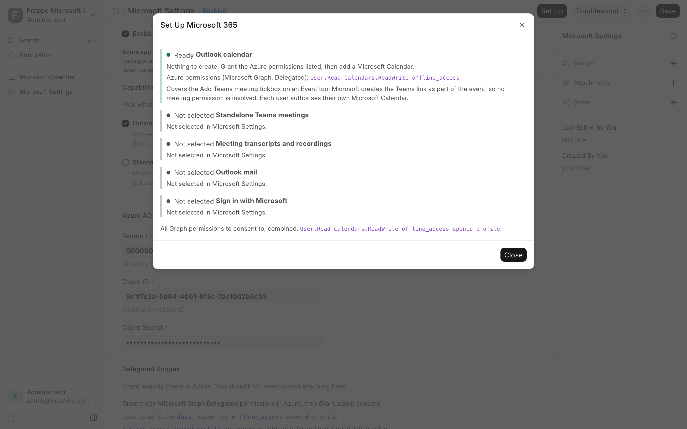
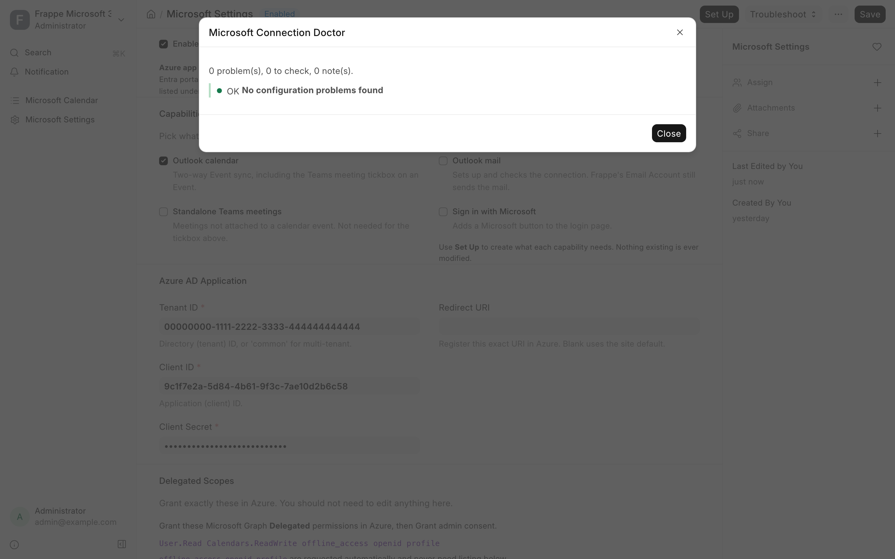
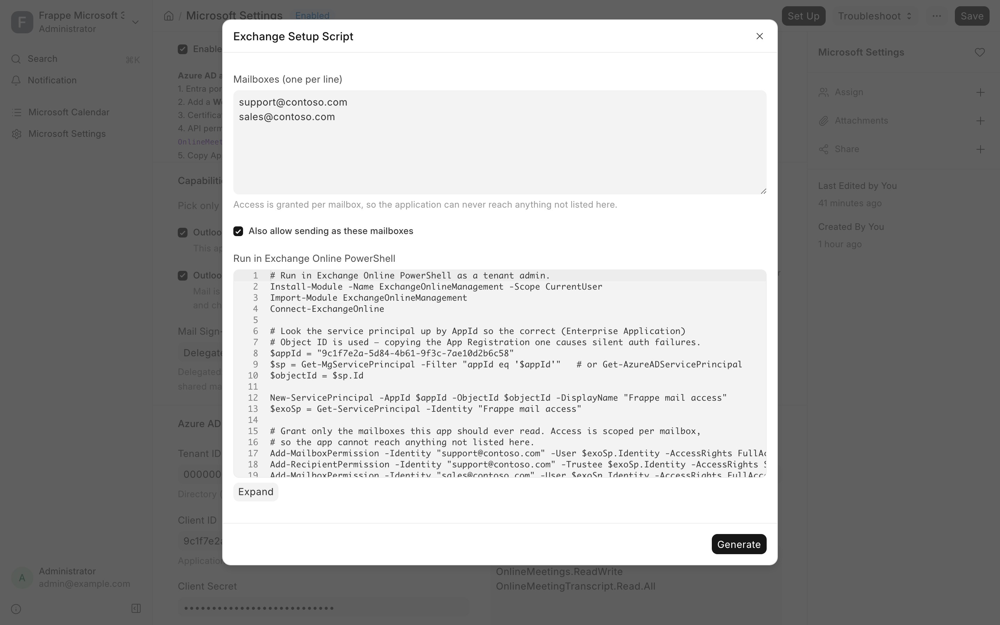
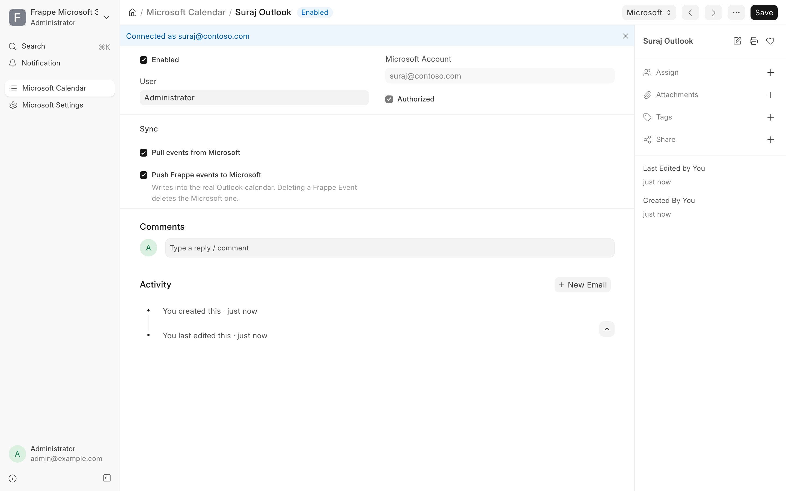

<div align="center">
	
	<h2>Frappe Microsoft 365</h2>
	<p><b>Outlook calendar, Teams meetings and Microsoft setup that actually explains itself</b></p>


</div>

Generic **Microsoft 365 integration for any Frappe / ERPNext site** — the Microsoft counterpart to
Frappe's built-in Google Calendar integration. Register one Azure application, tick the
capabilities you actually want in **Microsoft Settings**, and let each user authorize their own
**Microsoft Calendar**.

You get Outlook calendar sync in both directions, Teams meetings created from a Frappe Event,
invitations you can reply to without leaving Frappe, and meeting transcripts — plus a
diagnostics tool for the part everyone loses time on, which is getting the connection to work
in the first place.

## Features

- **Outlook calendar, two ways** — Microsoft events ↔ Frappe `Event`. Delta pull on a schedule,
  push on save and delete. Recurring series arrive as individual occurrences without
  duplicating, deletions propagate, and a failed pull never silently skips a window.
  See *How the sync behaves*.
- **Teams meetings from a Frappe Event** — an **Add Teams meeting** tickbox, the same idea as
  Outlook's own. The join link comes back onto the Event, and a meeting organised in Outlook
  keeps its link when it syncs in, so people can join from either side. No extra Azure
  permission.
- **Attendees and RSVP** — organiser, the attendee list with everyone's reply, and your own
  response status on the Event, plus **Accept / Tentative / Decline** buttons on invitations you
  received. Frappe's event participants go out as Outlook attendees.
- **Transcripts and recordings land on the Event** — the transcript is attached as a `.vtt` you
  can search and keep; the recording stays with Microsoft and streams through Frappe on demand
  rather than filling your file store. Microsoft takes minutes to hours to produce them, so the
  app keeps asking on a backoff for a day instead of reporting an empty answer as *nothing was
  recorded* — and a five-hour meeting's two recording parts both arrive, because Teams splits at
  four hours. See *Transcripts and recordings*.
- **Take only the parts you want** — calendar, Teams meetings, transcripts, mail and sign-in are
  independent. The Azure scopes are **derived from what you tick** and shown before you
  authorise, so the permissions you grant in Azure and the ones the app requests cannot drift
  apart. Setting up mail or sign-in creates what each needs and never modifies anything that
  already exists.
- **A doctor for when it breaks** — connecting Frappe to Microsoft 365 takes fifteen-odd steps
  across two Microsoft portals, and almost every mistake surfaces as `AUTHENTICATE failed` or
  `535 5.7.3`. **Setup Guide** walks them in the order they have to happen; **Run Diagnostics**
  reads your configuration and names the failing step; **Explain an Error** decodes a message
  from the Error Log into a cause and a fix.
- **Secure by design** — MSAL auth-code flow, token refresh, CSRF state validation; secrets and
  tokens are stored as `Password` fields and never logged or returned to clients. The two
  actions with consequences outside Frappe warn and confirm first.

<details open>
<summary><b>View Screenshots</b></summary>

<br />

**Join a meeting, reply to an invitation, and see who else has — from the Event itself**


**Tick only the capabilities you want; the Azure permissions follow from what you tick**


**Set Up shows a plan first, and never modifies anything that already exists**


**The connection doctor names the failing step instead of leaving you with `AUTHENTICATE failed`**


**Exchange setup script for shared mailboxes, with the service principal looked up by AppId**


**A per-user connection, with its own pull and push toggles**


</details>

## Requirements

- A Frappe **v15 or v16** bench ([install guide](https://frappeframework.com/docs/user/en/installation)).
- Python ≥ 3.10 (whatever your Frappe version requires: v15 runs on 3.10+, v16 needs 3.14).
  The only extra dependency is **`msal`** (declared in `pyproject.toml`, installed
  automatically by `bench get-app`).
- An **Azure AD (Microsoft Entra) app registration** — free; walked through step by step below.

## Compatibility

| Frappe / ERPNext | Branch | CI |
| --- | --- | --- |
| version-16 | `version-16` (or `main`) | every push and PR |
| version-15 | `version-15` (or `main`) | every push and PR |

One codebase supports both. `main` is the source of truth; `version-15` and `version-16` track
it so the usual `bench get-app --branch <version>` works. Nothing here is version-gated, and
every change is proven against **both** versions in CI (install, migrate, and the full test
suite on each) before it lands. [`docs/compatibility.md`](docs/compatibility.md) records the
API-by-API evidence, including the one place where version-specific code exists.

## Frappe Cloud

The app declares its supported Frappe range in `pyproject.toml`, which is what Frappe Cloud
reads when you add it to a bench:

```toml
[tool.bench.frappe-dependencies]
frappe = ">=15.0.0-dev,<17.0.0"
```

Without that section Frappe Cloud refuses the app with *"Could not find a compatible Frappe
version in pyproject.toml"*. The lower bound is anchored at `-dev` because pre-release builds
report versions like `15.0.0-dev`, which sort **below** `15.0.0` under semver.

## Install (existing bench)

```bash
cd /path/to/your/bench

# either branch works; pick the one matching your bench
bench get-app https://github.com/Bizmap-Technologies-Pvt-Ltd/frappe_microsoft365 --branch version-16

bench --site your-site.localhost install-app frappe_microsoft365
bench --site your-site.localhost migrate
```

If `msal` didn't get pulled in automatically: `./env/bin/pip install msal`.

## Quick start from scratch (try it on a fresh local site)

```bash
# 1. (one-time) install bench + Frappe — see the Frappe install guide above, then:
bench new-site m365.localhost --admin-password admin
bench --site m365.localhost set-config developer_mode 1

# 2. get + install this app
bench get-app https://github.com/Bizmap-Technologies-Pvt-Ltd/frappe_microsoft365
bench --site m365.localhost install-app frappe_microsoft365
bench --site m365.localhost migrate

# 3. run it
bench start          # then open http://m365.localhost:8000/app
```

Now do the Microsoft side — *Set it up, in order*, below. The one value Entra needs from you is
the **Redirect URI**:

```
http://m365.localhost:8000/api/method/frappe_microsoft365.frappe_microsoft_365.doctype.microsoft_calendar.microsoft_calendar.callback
```

(Use your real site URL/port. `http://...localhost` is accepted by Azure for local testing.)

## Set it up, in order

Setup spans **two Microsoft portals and Frappe**, and the order is not decoration. The permission
list depends on what you ticked in Frappe; the tenant switch in step 7 lives in a portal most
people never open; and the token you end up with carries only the permissions that were consented
*before* it was issued. Done out of order, every one of those bites you as a 403 that names
nothing.

The same checklist is available inside the app: **Microsoft Settings → Setup Guide**.

### 1. Frappe — tick the capabilities you want

`Microsoft Settings → Capabilities`

Calendar, Teams meetings, transcripts, mail and sign-in are independent — tick what you want and
leave the rest alone. **Delegated Scopes**, immediately below, then prints the exact permission
list to grant. Copy it: step 5 is nothing but pasting it into Entra.

Do this first. Which permissions to grant, and whether you have to visit the Teams admin center at
all, both follow from it.

### 2. Entra — register the application

`entra.microsoft.com → Entra ID → App registrations → New registration`

- **Name:** anything you will recognise later, e.g. `Frappe Microsoft 365`.
- **Supported account types:** *Accounts in this organizational directory only* unless people from
  other Microsoft work/school tenants have to connect. Personal Microsoft accounts cannot use the
  Teams or transcript permissions at all.
- Leave the redirect URI blank — it is the next step.

Afterwards, from the app's **Overview** page, copy **Application (client) ID** and **Directory
(tenant) ID**. You paste both into Frappe in step 8.

### 3. Entra — add the redirect URI

`Your app → Authentication → Add a platform → Web`

```
https://<your-site>/api/method/frappe_microsoft365.frappe_microsoft_365.doctype.microsoft_calendar.microsoft_calendar.callback
```

The platform must be **Web** — this is a confidential client with a secret, not a SPA. The URI has
to match what Frappe sends *exactly*: scheme, host, port, path. `http://` is accepted for
`localhost` hosts, so local testing works. A mismatch surfaces at sign-in as `AADSTS50011` and
never says which character is wrong.

### 4. Entra — create a client secret

`Your app → Certificates & secrets → Client secrets → New client secret`

**Copy the Value, not the Secret ID.** Azure prints them side by side in the same row, only the
Value works, and it is shown once and never again. Microsoft's only comment on the mix-up is
`AADSTS7000215` at sign-in, long after you have moved on — which is why Microsoft Settings refuses
a secret that looks like a GUID on save.

Note the expiry date. Secrets expire and sign-in stops working the day they do.

### 5. Entra — add the delegated permissions

`Your app → API permissions → Add a permission → Microsoft Graph → Delegated permissions`

Add exactly what Microsoft Settings printed in step 1 — no more. Asking for scopes the tenant never
consented to is itself a way to make sign-in fail.

**Granting one does not imply the others.** They stack:

| Ticked in Frappe | Delegated Microsoft Graph permissions |
| --- | --- |
| Outlook calendar | `User.Read` `Calendars.ReadWrite` |
| Standalone Teams meetings | `User.Read` `OnlineMeetings.ReadWrite` |
| Meeting transcripts and recordings | the row above, **plus** `OnlineMeetingTranscript.Read.All` `OnlineMeetingRecording.Read.All` |

Transcripts are the row people get wrong, and all three permissions are load-bearing.
`OnlineMeetingTranscript.Read.All` reads a transcript you can already address by online meeting id
— but you start from a join URL, and turning that into a meeting id is `OnlineMeetings.ReadWrite`.
Recordings are consented separately again as `OnlineMeetingRecording.Read.All`, because Microsoft
treats reading the words and reading the video as different permissions and plenty of tenants grant
one and refuse the other. Frappe enforces the first half: *Meeting transcripts and recordings* only
appears once *Standalone Teams meetings* is on, and is cleared if you turn that back off.

`offline_access`, `openid` and `profile` are requested automatically at sign-in and never belong in
a list you maintain — but `offline_access` still has to be **granted here** like any other, or
Microsoft issues no refresh token and the connection dies when the first access token expires.

Mail and sign-in are not Graph permissions at all; their lists are in *Set up only what you want*.

### 6. Entra — grant admin consent, and check it took

`Your app → API permissions → Grant admin consent for <tenant>`

Then read the **Status** column. Every permission you added should show a green tick and
**Granted for &lt;tenant&gt;**. A row still reading *Not granted* is a permission that will 403 at
runtime however correctly the app asks for it.

If the button is greyed out, your account cannot consent — a Privileged Role Administrator or
Cloud Application Administrator has to do this step for you.

### 7. Teams admin center — turn on transcript API access

**Only if you ticked transcripts.** Skip this step otherwise.

`admin.teams.microsoft.com → Meetings → Meeting settings → Transcript API access`

This is a **different portal from Entra**, and consent is no substitute for it. Microsoft added a
tenant-level switch for Graph access to transcripts in 2026 and **ships it off**, so a tenant with
every permission granted and consented still gets:

```
403 Forbidden: Graph API access to transcripts is disabled for this tenant.
```

Turn **Microsoft Graph access** **On**. Then select **Configure** and turn **Include speaker
attribution** **On** if you want speaker names in the VTT — that one is off by default too, and
without it the transcript is text with nobody's name against it.

The PowerShell equivalent, if you would rather not click:

```powershell
Set-CsTeamsMeetingConfiguration -EnableGraphTranscriptAccess true -EnableAttributedTranscripts true -Identity Global
```

There is no request-side workaround and re-granting consent does nothing, which is why both the
error message and the doctor name this switch specifically rather than blaming permissions.

### 8. Frappe — paste the credentials and enable

`Microsoft Settings → Azure AD Application`

Paste **Tenant ID**, **Client ID** and the secret **Value** from step 4, tick **Enabled**, Save.

Leave **Redirect URI** blank unless the site's public URL is not what Frappe computes — blank uses
the site URL, which is right for most installs. If you do fill it in, it must match the URI you
registered in step 3 character for character.

### 9. Frappe — Set Up (only if you ticked mail or sign-in)

`Microsoft Settings → Set Up`

Calendar, Teams and transcripts need nothing created; this app talks to Graph directly. This step
exists for **Outlook mail**, which needs a `Connected App` for Frappe's Email Account, and **Sign
in with Microsoft**, which needs a `Social Login Key`. Set Up shows a plan first and only ever
creates what is missing — anything that already exists is reported and left exactly as it is.

The mail `Connected App` has a redirect URI of its own, computed by Frappe from the record name, so
it cannot be known until the record exists. Register that one in Entra too; **Run Diagnostics**
prints the exact URI. A missing one shows up later as `AADSTS50011`.

### 10. Frappe — authorize a connection

`Microsoft Calendar → New → Save → Authorize Microsoft Access`

Give the connection an **Account Name**, set **User** to the person it belongs to, Save, then
authorize and sign in as that person. The Microsoft account email and default calendar fill in
automatically.

Two toggles here are off on purpose. **Push Frappe events to Microsoft** stays off until you want
Frappe writing into a real calendar. **Fetch transcripts after meetings** stays off until you want
them collected without anyone pressing a button.

**If a connection already existed when you changed the capabilities, Re-authorize it.** A token
carries the permissions consented when it was issued; ticking another capability does not widen a
token that already exists, and the new feature fails with a 403 that explains nothing. This is why
step 1 is step 1. **Scopes Last Authorised** on Microsoft Settings records what the last sign-in
actually asked for, and Run Diagnostics compares it against what is requested now.

### 11. Verify

- **Microsoft Settings → Troubleshoot → Run Diagnostics.** It reads the whole configuration —
  settings, the Connected App, every Email Account, the authorised scopes — and names the failing
  step instead of the symptom.
- **The Delegated Scopes preview** shows exactly what sign-in will request. If it lists something
  you did not grant in step 5, sign-in fails; if you granted something it does not list, you
  granted more than this app will ever use.
- **Microsoft Calendar → Test Connection**, then **Sync Now**. A working sync reports *Pulled n,
  deleted n, pushed n*.
- **Transcripts:** open an Event whose Teams meeting has finished and click **Get Transcript &
  Recording**. Working looks like a `.vtt` attached to the Event and the recordings listed on it.
  *Microsoft has not finished processing this meeting* is a normal answer in the first half hour —
  see *Transcripts and recordings*. A 403 naming the tenant is step 7; a 403 naming permissions is
  step 5 or 6.

Azure-side detail beyond this, including the app-only path for shared mailboxes:
[`docs/azure-setup.md`](docs/azure-setup.md).

## How the sync behaves

Worth knowing before you trust it with a real calendar:

- **Delta queries, not "modified since".** The pull runs `/me/calendarView/delta`, so recurring
  series arrive as individual occurrences with stable ids (no duplicates on later runs) and
  deletions arrive as `@removed` entries (no orphaned Frappe Events). The delta link is stored
  on the Microsoft Calendar and is the sync watermark.
- **A failed pull never advances the watermark.** If Graph errors halfway, the next run repeats
  that window instead of skipping it. The reason is written to **Last Sync Error** on the form.
- **Every page is read.** Collection reads follow `@odata.nextLink` to the end, so a calendar
  with hundreds of events in the window imports completely, not just the first page.
- **Origin decides who wins.** An Event that originated in Frappe keeps
  `custom_pulled_from_microsoft = 0` for life: the pull refreshes its subject, times and
  location from Outlook but never overwrites its description (Graph only returns a truncated
  plain-text preview) and never flips the flag, so later local edits keep syncing out.
  Events that originated in Microsoft are mirrors and are fully overwritten.
- **Nothing is saved when nothing changed**, so `modified` does not churn and the push step does
  not patch the same event back to Graph on every run.
- **The delta window** covers 30 days back and 180 days forward, and is re-initialised
  automatically when its far edge gets within 14 days.
- **Concurrency and throttling.** Each calendar syncs under a file lock, so a slow run is never
  overlapped by the next cron. A `429` is retried once after a short `Retry-After`; longer
  backoffs are left to the next scheduled run. A `410` (expired delta token) restarts a full
  sync automatically.
- **Timezones.** Graph is asked for UTC, and Windows timezone ids (`Pacific Standard Time`) are
  mapped to IANA rather than silently assumed to be UTC.

Access to `Microsoft Calendar` is granted to **System Manager** and **Desk User** (the same
pattern Frappe's Google Calendar uses), and each user only sees their own connection.

## Set up only what you want

Calendar, Teams meetings, transcripts, mail and sign-in are **independent**. Tick the ones you
want in Microsoft Settings and leave the rest alone — nothing is created for a capability you
did not ask for, and none of them depend on each other. Use the calendar without mail, mail
without sign-in, sign-in on its own; all valid.

**Set Up** shows a plan first: what will be created, what already exists, which Azure
permissions each capability needs, and only then offers to apply it.

| Capability | What gets created | Azure permissions |
| --- | --- | --- |
| Outlook calendar | Nothing — this app talks to Graph directly | Graph delegated: `User.Read`, `Calendars.ReadWrite`, `offline_access` |
| Standalone Teams meetings | Nothing — this app talks to Graph directly | Graph delegated: `User.Read`, `OnlineMeetings.ReadWrite`, `offline_access` |
| Meeting transcripts and recordings | Nothing — this app talks to Graph directly | Graph delegated: `User.Read`, `OnlineMeetingTranscript.Read.All`, `OnlineMeetingRecording.Read.All`, `offline_access` |
| Outlook mail | A `Connected App` for Frappe's Email Account | Exchange delegated: `IMAP.AccessAsUser.All`, `SMTP.Send`, `offline_access` — or the `.default` app-only scope for shared mailboxes |
| Sign in with Microsoft | A `Social Login Key` | Graph delegated: `openid`, `email`, `profile` |

### The scopes follow the tickboxes

**You do not write a scope list.** Microsoft Settings derives the delegated scopes from the
capabilities above and shows the exact result under **Delegated Scopes**, so what you grant in
Azure and what sign-in asks for cannot drift apart.

The split is what makes that work. **Outlook calendar** is `Calendars.ReadWrite` and nothing
else — including the **Add Teams meeting** tickbox on an Event, because Microsoft mints the
Teams link as part of the event rather than as a separate meeting. `OnlineMeetings.ReadWrite`
is only for meetings created outside a calendar event and for resolving a join URL back to a
meeting; `OnlineMeetingTranscript.Read.All` and `OnlineMeetingRecording.Read.All` are only
for transcripts and recordings. All are permissions tenants routinely refuse — reading the
words and reading the video are consented separately — which is why wanting a calendar no
longer asks for any of them.

Transcripts build on standalone meetings, so their tickbox appears only once that one is on,
and turning that one back off turns transcripts off with it rather than leaving a hidden
capability asking Azure for consent.

`offline_access`, `openid` and `profile` are added automatically at sign-in and never belong in
a scope list of your own.

**Override Delegated Scopes** is the escape hatch, empty by default: fill it in only when your
tenant consents to a hand-picked list and sign-in has to ask for exactly that. An override is
used verbatim, and the doctor warns if it omits something a ticked capability needs.

Changing any of this affects new sign-ins only. Tokens carry the permissions that were
consented when they were issued, so after a change the doctor tells you which connections need
**Re-authorize** rather than letting the new feature fail with a bare 403.

**It never overwrites anything.** If a record already exists it is left exactly as it is and
reported, with any drift from Microsoft Settings spelled out, so a setup someone tuned by hand
survives untouched. Running Set Up twice does nothing the second time.

Two details it gets right that are easy to miss by hand:

- Frappe's built-in Office 365 sign-in provider defaults to the `/common/` authority and the
  **v1.0** endpoints, neither of which works with a single-tenant app registration. Provisioning
  writes tenant-specific v2.0 endpoints instead.
- The `Connected App` redirect URI is computed by Frappe from the record name, so it is a
  *different* endpoint from this app's callback and cannot be known before the record exists.
  Azure needs **both** registered; the doctor prints the exact URI to add. A missing one shows
  up later as `AADSTS50011`.

## Connection doctor

Connecting Frappe to Microsoft 365 has roughly fifteen steps across Azure, Exchange and
Frappe, and almost every mistake surfaces as the same unhelpful string — `AUTHENTICATE
failed`, `535 5.7.3`, `invalid_grant` — with no clue which step was wrong.

**Microsoft Settings → Troubleshoot** gives you three tools:

- **Run Diagnostics** inspects Microsoft Settings, the Connected App and every Email Account
  and reports what is actually wrong. It catches the failures people hit most: delegated
  scopes on an app-only flow (or the reverse), a missing `offline_access` scope — the reason
  a connection works for an hour then needs re-authorising forever — v1.0 endpoints, tenant
  mismatches between settings and endpoints, redirect-URI drift, IMAP without a folder, a
  scope override that leaves out something a ticked capability needs, scopes that changed
  after connections were authorised (their tokens predate the change and have to be renewed),
  and the shared-mailbox identity conflict described below.
- **Explain an Error** turns a message from the Error Log into a cause and a next step.
- **Wrong-box mistakes are caught as you type them.** Azure shows a secret's **Value** next to
  its **Secret ID**, and only the Value works; pasting the ID is the commonest setup mistake
  there is, and Microsoft only says so at sign-in, as `AADSTS7000215`. A secret that is a GUID
  is refused on save, because a secret value never is one. The same shape checks cover the
  client id, the tenant id and the redirect URI.
- **Exchange Setup Script** generates the `New-ServicePrincipal` / `Add-MailboxPermission`
  commands for app-only mailbox access, looking the service principal up by AppId rather
  than asking you to copy an Object ID — Microsoft's own documentation warns that copying
  the one from the App Registration page (instead of the Enterprise Application page) causes
  authentication to fail with no useful error.

**The shared-mailbox identity conflict.** Microsoft requires the *shared mailbox address* in
the IMAP XOAUTH2 string but the *signing-in user* for SMTP. Frappe sends `login_id or
email_id` to both, so a single account cannot get incoming and outgoing right at the same
time — which is why "SMTP works but IMAP doesn't" recurs on the forum. The doctor flags the
configuration and suggests the two ways out: split incoming and outgoing into separate Email
Accounts, or use the app-only flow, where no user identity is involved.

### Teams meetings from a Frappe Event

An Event carries an **Add Teams meeting** tickbox, the same idea as Outlook's own toggle.
Tick it, save, and the event is created in Outlook as a Teams meeting. A **Join Meeting**
button then appears at the top of the Event, with **Open in Outlook** beside it.

It works in both directions: a Teams meeting organised in Outlook keeps its join link when it
syncs into Frappe, so people can join from either side.

No extra Azure permission is needed. Microsoft creates the meeting as part of the event, so
`Calendars.ReadWrite` covers it — the **Outlook calendar** capability on its own is enough.
`OnlineMeetings.ReadWrite` is only required for standalone meetings and transcripts, which are
separate tickboxes precisely so a calendar-only setup never has to ask for them.

**One limitation, enforced rather than explained away:** Microsoft cannot turn an existing
online meeting back into a plain event. So the tickbox **locks itself once the meeting exists**
rather than sitting there doing nothing when you untick it. To remove a meeting, delete the
event and create it again. The app only ever sends `isOnlineMeeting: true`.

### Attendees and RSVP

An invitation that lands in someone's Outlook is usable from Frappe. Each synced Event
carries three read-only fields, refreshed by every sync:

- **Organizer** — the Microsoft account that created the event.
- **Attendees** — one line per invitee: `Asha Rao <asha@example.com> — accepted`. Rooms and
  equipment are labelled with their type, because a room declining is a different problem
  from a person declining.
- **My Response** — your own reply, stored exactly as Microsoft words it (`accepted`,
  `declined`, `tentativelyAccepted`, `notResponded`, `organizer`, `none`).

On an event you were invited to, the Event form grows **Accept**, **Tentative** and
**Decline** buttons under a *Microsoft* menu. Each one offers an optional comment for the
organizer and a tickbox to reply without emailing anyone — the same choice Outlook gives
you. The reply goes straight to Microsoft and the Event updates immediately rather than
waiting for the next scheduled sync. The buttons stay hidden on events you organized
yourself, because there is nothing to reply to.

No new Azure permission is needed: `/me/events/{id}/accept`, `/decline` and
`/tentativelyAccept` all run on the delegated `Calendars.ReadWrite` the calendar sync
already holds.

Going the other way, an Event's **participants** are sent to Outlook as attendees when the
event is pushed. A participant whose email cannot be resolved — no address on the row and
none on the record it links to — is left out rather than sent as something Microsoft would
reject. If nobody resolves, the attendee list is omitted from the request entirely: Graph
reads an empty list as *remove everyone*, and that would silently uninvite people who were
added in Outlook.

**One limitation.** Zoom and Google Meet links are **not** extracted. Microsoft only fills
in the structured `onlineMeeting` property for its own Teams meetings; a third-party link
is loose text in the event body, and guessing at it would produce wrong links more often
than right ones. Open the event in Outlook for those.

### Transcripts and recordings

Once a Teams meeting has finished, its transcript is **attached to the Event as a `.vtt` file**
and its recordings are listed on the Event, ready to download.

**Nothing is ready the moment a meeting ends.** Microsoft publishes no schedule for this: an
ordinary meeting is usually ready in 5-30 minutes, a long or heavy one can take a few hours,
and Graph lags the Teams UI — the transcript can be readable in Teams while the API still
returns an empty list. So the app does not ask once and declare the meeting unrecorded:

- **It keeps asking, on a widening backoff.** 10 minutes after the meeting, then 25, 45, 75
  minutes, 2, 3, 4½, 6, 8, 10, 12, 16, 20 and 24 hours — fourteen attempts across a day. (Polling
  every fifteen minutes for the same day would cost ninety-six calls and find it no sooner.)
- **The manual button stays.** **Get Transcript & Recording** is always there while something is
  still missing, for when you don't want to wait for the next step.
- **The button disappears once there is nothing left to fetch.** With the transcript attached and
  a recording listed, the Event offers only **Download Recording**. With one of the two still
  missing it says exactly which — **Check for Recording**, **Check for Transcript**.

This is **opt-in per connection**: tick **Fetch transcripts after meetings** on a Microsoft
Calendar. Without it, nothing is fetched until someone presses the button.

**An empty answer means four different things, and the Event says which:**

| | What you are told |
| --- | --- |
| Minutes after the meeting | Microsoft has not finished processing this meeting. Checking again around *hh:mm*. |
| Microsoft returned an error | Microsoft's own error, verbatim — `ErrorAccessDenied`, a 403, whatever it said |
| A day later, still nothing | Most likely never recorded or transcribed. You can still check by hand. |
| More than ~60 days later | This meeting is too old — see the two clocks below |

**Long meetings come back in pieces.** A Teams recording stops and restarts at **4 hours or
1.5 GB**, whichever comes first, so a five-hour meeting is *two* recordings. Transcription can be
stopped and restarted too. Everything here is plural: every transcript is attached
(`…-part-1.vtt`, `…-part-2.vtt`), every recording is listed as *Part 1 of 2*, and **Download
Recording** asks which part you want.

**Two clocks end it, and neither is guesswork:**

- **The meeting expires.** Graph's list-recordings endpoint works only for a meeting that hasn't
  expired — **60 days** after a one-off meeting, with another 60 added whenever someone joins or
  edits it. After that these endpoints return nothing, whatever still sits in OneDrive.
- **The file expires.** Teams deletes recordings and transcripts on your tenant's retention
  policy — **120 days** by default, and an admin can set it from one day to never.

**Why the recording isn't just a link.** Graph's `recordingContentUrl` is an API endpoint that
requires a bearer token — paste it into a browser and you get `401`, not a video. So the download
streams through Frappe, authorised by Frappe's own permissions, and the token never leaves the
server. The bytes are not stored: a Teams recording routinely runs to hundreds of megabytes, and
copying one into the site's file store per meeting is a bad trade. A transcript is a few
kilobytes and is the part people search and quote, so that one *is* kept.

**One tenant switch, and it ships off.** Microsoft added a tenant-level control for Graph
access to transcripts in 2026 and **defaults it to off**, so a tenant with every permission
consented still gets `403 Forbidden: Graph API access to transcripts is disabled for this
tenant`. It lives in the Teams admin center, not Entra — step 7 of *Set it up, in order*. There
is no request-side workaround, and re-granting consent does nothing, which is why both the error
message and the doctor name this switch specifically rather than blaming permissions.

**Requirements.** Three delegated permissions, not one: `OnlineMeetings.ReadWrite` to turn a join
link into the meeting the transcript belongs to, `OnlineMeetingTranscript.Read.All` to read the
transcript, and `OnlineMeetingRecording.Read.All` for the recordings — which also need a Teams
licence that records. Microsoft consents to reading the words and reading the video separately, so
a tenant that refuses recordings still gets transcripts rather than losing both. Only meetings
created **as calendar events** have transcripts at all — standalone Teams meetings do not, which
is why this app creates them the calendar way.

**Why not webhooks?** Graph can push a notification the moment a transcript appears, but the
tenant-wide subscriptions (`getAllTranscripts`, `getAllRecordings`) are **application-permission
only** — standing access to every meeting in the tenant with nobody signed in — and the
per-meeting ones only notify if you subscribed *before the meeting started*, plus they need a
public HTTPS endpoint Microsoft can reach and renewal every few days. For a self-hosted Frappe
that is a worse trade than fourteen polls.

### Sensitive actions are called out before they happen

Three things have consequences outside Frappe, and none of them happen quietly:

- **Writing into a real calendar is opt-in.** `Push Frappe events to Microsoft` is **off by
  default**; pull is the safe direction. Turning push on asks you to confirm, and says plainly
  that deleting a Frappe Event will delete the Microsoft one.
- **The Exchange setup script** grants the application standing access to the mailboxes you
  list, readable with nobody signed in. The dialog explains that and will not generate the
  script until you confirm; the app never runs it, and **the script ends with the commands
  that undo it**, commented out so nothing reverses by accident.
- **A time range Microsoft would reject is caught on save**, not after the fact. Frappe does
  not enforce that an Event ends after it starts and pre-fills both times from the current
  moment, so an event saved without touching them can end before it begins. You are told while
  you can still fix it. Data arriving *from* Outlook is never second-guessed this way.

Sync also refuses to be half-configured: ticking **Sync with Microsoft Calendar** requires
choosing a connection, and enabling the integration requires the Azure credentials, so nothing
saves in a state that silently does nothing.

### What this does NOT do

It does not send or receive mail, replace `Email Account`, or touch the email queue. Frappe's
own IMAP/SMTP + OAuth path is unchanged, several mail accounts keep working exactly as they
did, and uninstalling this app leaves your mail setup working. The doctor only reads
configuration and generates text.

## How it's consumed (for app developers)

Other apps depend on this app and call its utilities (they never re-implement Graph):

| Purpose | Function |
| --- | --- |
| Settings / liveness | `frappe_microsoft365.microsoft_graph.get_settings()` |
| Authorize / callback / disconnect / test | `…doctype.microsoft_calendar.microsoft_calendar` → `authorize_access(calendar_name)`, `callback`, `test_connection(calendar_name)`, `disconnect(calendar_name)` |
| Create a Teams meeting | `frappe_microsoft365.microsoft_meetings.create_meeting(calendar_name, subject, start_datetime, end_datetime, attendees=None, body=None, create_calendar_event=True)` → `{event_id, web_link, join_url, online_meeting_id}` |
| Transcripts for a join URL | `frappe_microsoft365.microsoft_transcripts.get_transcripts_for_join_url(calendar_name, join_url)` → `{online_meeting_id, transcripts, latest_vtt}` |
| Read calendar events | `frappe_microsoft365.microsoft_calendar_sync.fetch_events(calendar_name, start_datetime, end_datetime)` |
| Reply to an invitation | `frappe_microsoft365.microsoft_rsvp.respond_to_event(event, response, comment=None, send_response=1)` — `response` is `accept`, `decline` or `tentative` |

Example: **Bizmap OS** delegates its meeting/calendar features to these functions when this app is
installed and Microsoft Settings is configured, and falls back to stubs otherwise.

See [`docs/graph-api-reference.md`](docs/graph-api-reference.md) for the verified Graph
endpoint/permission contract, and [`docs/azure-setup.md`](docs/azure-setup.md) for Azure setup.

## Troubleshooting

Step numbers refer to *Set it up, in order*.

| Symptom | Cause | Fix |
| --- | --- | --- |
| `403 Forbidden: Graph API access to transcripts is disabled for this tenant` (inner error `GraphAccessToTranscriptsDisabled`) | The tenant switch, which Microsoft ships **off**. Not a permission problem | Step 7. Teams admin center, not Entra. Re-granting consent does nothing |
| `403` on transcripts naming permissions or authorization | `OnlineMeetingTranscript.Read.All` missing, or granted but never consented | Steps 5 and 6, then **Re-authorize** every Microsoft Calendar |
| Transcripts work, recordings 403 | `OnlineMeetingRecording.Read.All` is consented separately, and a Teams licence that records is needed | Add it in step 5, consent, Re-authorize |
| `Microsoft could not match this join link to a meeting` | Only `OnlineMeetingTranscript.Read.All` was granted; turning a join URL into a meeting id is a different permission — or the meeting has expired | Add `OnlineMeetings.ReadWrite` (step 5), consent, Re-authorize |
| Speaker names missing from the `.vtt` | *Include speaker attribution* is off by default | Step 7 → **Configure** |
| A newly ticked capability 403s while everything else works | Tokens carry the scopes consented when they were issued, and do not widen | **Re-authorize** each Microsoft Calendar. Run Diagnostics names which ones |
| Works for an hour, then needs re-authorising forever | `offline_access` was never granted, so Microsoft returns no refresh token | Grant `offline_access` (step 5), consent, Re-authorize |
| `AADSTS50011` | The redirect URI does not match one registered on the app, to the character | Step 3. The mail `Connected App` has a second URI of its own — Run Diagnostics prints it |
| `AADSTS7000215` / `invalid_client` | The Secret ID was pasted instead of the secret Value, or the secret expired | Step 4. Create a new secret and copy the **Value** column |
| `AADSTS65001` | Admin consent was never granted | Step 6 |
| `AADSTS700016` | The application is not in this tenant | Wrong Tenant ID in step 8, or the app was never consented into the tenant |
| `invalid_grant` | The refresh token expired, or consent or the password changed | **Re-authorize**. Recurring within hours means `offline_access` is missing |
| Transcript list is empty on a meeting you know was transcribed | Processing lag, a standalone (not calendar-associated) meeting, or a meeting past its expiry | Wait — the app keeps asking for a day. See *Transcripts and recordings* |
| `AUTHENTICATE failed` / `535 5.7.3` on mail | A dozen unrelated causes, all rendered identically | **Explain an Error**, then Run Diagnostics — the shared-mailbox identity conflict is one of them |
| `Unknown column 'custom_..._microsoft...'` | The app's custom fields are not on this site | `bench --site <site> migrate` |

**Explain an Error** (Microsoft Settings → Troubleshoot) decodes any message from the Error Log
into a cause and a next step, including ones not listed here.

## Contributing

```bash
cd apps/frappe_microsoft365
pre-commit install   # ruff, eslint, prettier, pyupgrade
```

Issues and PRs welcome.

## License

MIT
